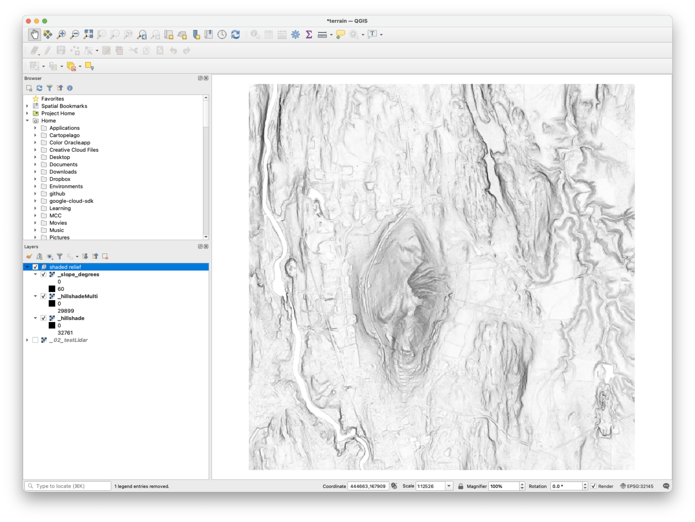

## Purpose  

The heatLoadIndex tool produces a heat load index layer from a DEM.  

## Background  

*Need discussion of climate change refugia. Reference this [review article](https://drive.google.com/file/d/1XnwXB7ciCYwoatmLcbT7yjwTtmFtVucw/view?usp=sharing){target=_blank} and this [methods article](https://journals.plos.org/plosone/article?id=10.1371/journal.pone.0143619){target=_blank}.*

## 1. Get script  

Download 'heatLoadIndex.py' from the [reland-tools/wbHome repo](https://github.com/GEOG0310/reland-tools/tree/master/wbHome){target=_blank}.  

## 2. Organize workspace     

Put the python file into your wbt_pySpace directory so that it sits with your 'helloWhitebox.py' file and your WBT folder.

## 3. Edit the script  

With Atom, open the python file.  

You will need to alter the working directory path. I suggest that you make a 'data' directory within your 'wbt_pySpace' directory (if you do not already have one), then use that path as the working directory. (Replace the path shown below).    

```python
wbt.work_dir = "/Users/jhowarth/projects/GEOG0310/reland-tools/wbHome/data"
```

Also check the name for your DEM (it may not be the same as below).

```python
dem = "../testDEM/_02_testLidar.tif"
```

*We will take a moment here to walk through how the script works*.  

## 4. Run the script  

In Atom, packages>script>run script. (Short cut: Command-I on Mac or Control-I on Windows).  

## 5. Inspect result  

In Q, add the layer to a project.   



## 6. Style your layer 

In Q, change symbology to display layer with three classes that follow Theobald article.    
